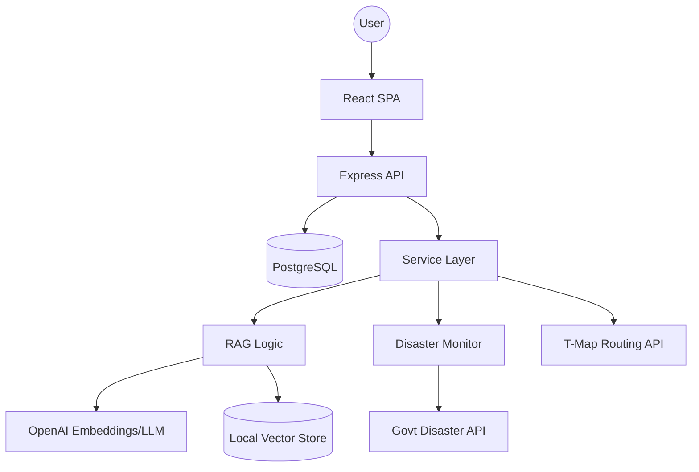

# SafeCompass (안전나침반)
 
[](https://www.typescriptlang.org/)
[](https://reactjs.org/)
[](https://nodejs.org/)
[](https://openai.com/)
[](https://opensource.org/licenses/MIT)

**[KO(한국어)](./README_KO.md) | EN(English)**

### A personalized RAG-powered disaster response solution tailored for individual accessibility needs.

---

## 🧭 Overview

**SafeCompass** is a next-generation emergency response platform that solves the "generic alert" problem. Standard disaster messages often provide vague instructions that don't account for a user's specific location, mobility, or language. 

SafeCompass uses **Retrieval-Augmented Generation (RAG)** to ingest official government safety manuals and generate hyper-personalized, actionable instructions based on:
1.  **User Profile**: Disability status, mobility (independent/assisted), and language.
2.  **Current Situation**: Location context (indoor/outdoor/subway) and disaster type.
3.  **Expert Knowledge**: Real-time retrieval from official disaster response manuals.

---

## ✨ Key Features

-   **🤖 RAG-Driven Guidance**: Utilizes OpenAI GPT-4o and custom vector search to provide high-reliability instructions extracted directly from official safety manuals.
-   **♿ Accessibility-First Design**: Includes visual, vibration, and flashlight alerts for users with hearing or visual impairments.
-   **🗺️ Smart Shelter Routing**: Integrated T-Map API for real-time pedestrian route calculation to the nearest verified shelters.
-   **🌍 Multi-lingual Support**: Full UI and guide generation support for Korean, English, Vietnamese, and Chinese.
-   **📡 Real-time Monitoring**: Automated polling of government disaster message APIs to trigger immediate, contextual alerts.
-   **🚨 OS-Level SOS**: Quick-access floating SOS button for immediate reporting and emergency contact notification.

---

## 🛠️ Tech Stack

### Frontend
| Tech | Purpose |
| :--- | :--- |
| **React 18** | UI Framework |
| **Tailwind CSS** | Utility-first Styling |
| **Radix UI / Shadcn** | Accessible Component Library |
| **Framer Motion** | High-performance Animations |
| **TanStack Query** | Asynchronous State Management |
| **Wouter** | Lightweight Routing |

### Backend & AI
| Tech | Purpose |
| :--- | :--- |
| **Node.js / Express** | Server Environment & API |
| **TypeScript** | Type-safe Development |
| **OpenAI API** | LLM (GPT-4o) & Embeddings (text-embedding-3-small) |
| **Drizzle ORM** | Type-safe SQL Database Interaction |
| **PostgreSQL (Neon)** | Scalable Serverless Database |

---

## 🏗️ Architecture

SafeCompass follows a streamlined Three-Tier architecture with a dedicated Service Layer for AI business logic.



---

## 📂 Directory Structure

```text
SHAFECOMPASS/
├── client/                 # Frontend React application
│   ├── src/
│   │   ├── components/     # Atomic UI components & SOS logic
│   │   ├── hooks/          # Custom hooks for Emergency/User state
│   │   ├── pages/          # RAG Management, Alerts, Dashboard
│   │   └── services/       # API integration layer
├── server/                 # Backend Express application
│   ├── services/           # Core AI, RAG, and monitoring logic
│   ├── routes/             # REST API endpoints (PDF, Disaster, etc.)
│   └── storage.ts          # Database repository pattern
├── data/
│   └── vector_store/       # Local vector database (chunks & metadata)
├── shared/
│   └── schema.ts           # Shared Zod types and DB schemas
└── test/                   # RAG evaluation and API testing
```

---

## 🚀 Getting Started

### Prerequisites
-   Node.js (v20+)
-   PostgreSQL (or Neon DB account)
-   OpenAI API Key
-   T-Map API Key

### Installation

1.  **Clone the repository**
    ```bash
    git clone https://github.com/your-username/SafeCompass.git
    cd SafeCompass
    ```

2.  **Install dependencies**
    ```bash
    npm install
    ```

3.  **Setup Environment Variables**
    Create a `.env` file in the root directory:
    ```env
    DATABASE_URL=your_postgres_url
    OPENAI_API_KEY=your_openai_key
    TMAP_API_KEY=your_tmap_key
    DATA_GO_KR_API_KEY=your_govt_api_key
    ```

4.  **Initialize Database**
    ```bash
    npm run db:push
    ```

5.  **Run Development Server**
    ```bash
    npm run dev
    ```

---

## 🧠 What I Learned / Challenges

### 1. Light-weight RAG Implementation
Instead of using a complex external Vector DB, I implemented a local JSON-based vector storage system for retrieval. This significantly reduced infrastructure costs and latency for this specific use case (disaster manuals), while maintaining high precision for the LLM context.

### 2. Inclusive UI/UX Patterns
Designing for emergencies meant conventional "pretty" UI wasn't enough. I had to solve for "Panic UX"—ensuring the app is usable under stress. This led to high-contrast themes, large touch targets, and tertiary alert channels like vibration and flashlight patterns.

### 3. Asynchronous Disaster Monitoring
Coordinating multiple live data streams (Govt API, GPS, and user state) required a robust polling and notification service. I built a singleton monitoring service in the backend that intelligently filters alerts to prevent "alert fatigue" while ensuring critical warnings are never missed.

---

## 🔮 Future Improvements

-   **Offline Mode**: PWA support with cached manuals and vector store for use during network outages.
-   **Community Heatmaps**: Crowdsourced reporting of blockages or damaged shelters.
-   **Wearable Integration**: Haptic feedback alerts for Apple Watch / Wear OS.

---

## 📄 License
This project is licensed under the MIT License - see the [LICENSE](LICENSE) file for details.
