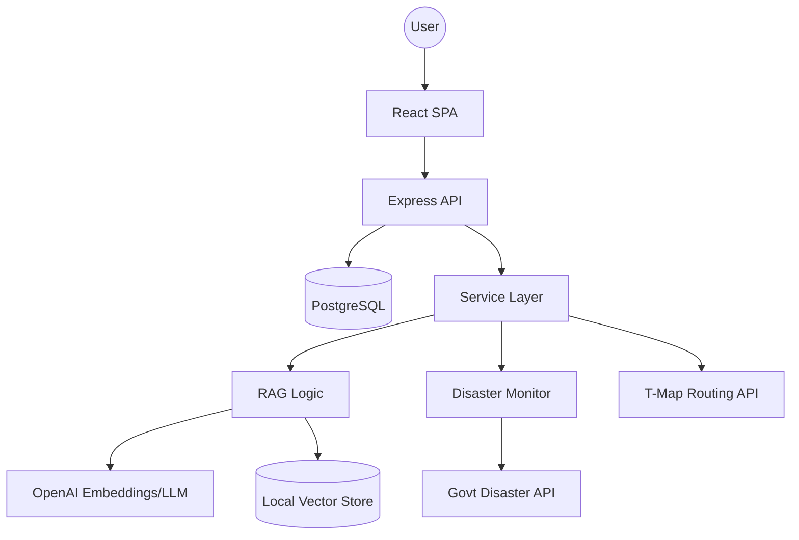

# SafeCompass (안전나침반)

[](https://www.typescriptlang.org/)
[](https://reactjs.org/)
[](https://nodejs.org/)
[](https://openai.com/)
[](https://opensource.org/licenses/MIT)

**EN(English) | [KO(한국어)](./README_KO.md)**

### 개별 사용자의 접근성 요구사항에 최적화된 맞춤형 RAG 기반 재난 대응 솔루션

---

## 🧭 개요 (Overview)

**안전나침반(SafeCompass)**은 기존 재난 문자의 '일률적인 안내' 문제를 해결하는 차세대 긴급 대응 플랫폼입니다. 표준 재난 문자는 사용자의 구체적인 위치, 이동 능력, 언어 환경을 고려하지 않은 모호한 지침을 제공하는 경우가 많습니다.

안전나침반은 **검색 증강 생성(RAG)** 기술을 활용하여 정부 공식 안전 매뉴얼을 학습하고, 다음 요소들을 결합하여 고도로 개인화된 행동 지침을 생성합니다:
1.  **사용자 프로필**: 장애 여부, 이동 능력(독립형/보조 필요), 선호 언어.
2.  **현재 상황**: 위치 상황(실내/실외/지하철) 및 재난 유형.
3.  **전문 지식**: 공식 재난 대응 매뉴얼로부터 실시간으로 추출된 신뢰할 수 있는 정보.

---

## ✨ 핵심 기능 (Key Features)

-   **🤖 RAG 기반 맞춤 가이드**: OpenAI GPT-4o와 커스텀 벡터 검색을 결합하여 공식 매뉴얼에서 직접 추출한 신뢰도 높은 대응 지침을 제공합니다.
-   **♿ 접근성 중심 설계**: 청각 또는 시각 장애가 있는 사용자를 위해 시각적 알림, 진동 패턴, 플래시 알림 등 다중 채널 알림을 지원합니다.
-   **🗺️ 스마트 대피로 안내**: T-Map API를 연동하여 검증된 가장 가까운 대피소까지의 실시간 도보 경로를 계산하고 안내합니다.
-   **🌍 다국어 지원**: 한국어, 영어, 베트남어, 중국어에 대한 전체 UI 및 맞춤형 가이드 생성 기능을 지원합니다.
-   **📡 실시간 모니터링**: 행정안전부 재난 문자 API를 상시 모니터링하여 즉각적이고 상황에 맞는 알림을 트리거합니다.
-   **🚨 OS 레벨 SOS**: 긴급 상황 발생 시 즉시 신고하고 비상 연락처에 알림을 보낼 수 있는 퀵 액세스 플로팅 버튼을 제공합니다.

---

## 🛠️ 기술 스택 (Tech Stack)

### Frontend
| 기술 | 용도 |
| :--- | :--- |
| **React 18** | UI 프레임워크 |
| **Tailwind CSS** | 유틸리티 퍼스트 스타일링 |
| **Radix UI / Shadcn** | 웹 접근성 준수 컴포넌트 라이브러리 |
| **Framer Motion** | 고성능 인터랙티브 애니메이션 |
| **TanStack Query** | 비동기 상태 관리 및 캐싱 |
| **Wouter** | 경량화된 라우팅 처리 |

### Backend & AI
| 기술 | 용도 |
| :--- | :--- |
| **Node.js / Express** | 서버 환경 및 API 개발 |
| **TypeScript** | 정적 타입을 통한 안정적인 개발 |
| **OpenAI API** | LLM(GPT-4o) 및 임베딩(text-embedding-3-small) 모델 |
| **Drizzle ORM** | 타입 세이프한 SQL DB 상호작용 |
| **PostgreSQL (Neon)** | 확장 가능한 서버리스 데이터베이스 |

---

## 🏗️ 아키텍처 (Architecture)

안전나침반은 AI 비즈니스 로직을 위한 전용 서비스 레이어를 포함한 3계층(Three-Tier) 아키텍처를 따릅니다.



---

## 📂 디렉토리 구조 (Directory Structure)

```text
SHAFECOMPASS/
├── client/                 # 프론트엔드 React 애플리케이션
│   ├── src/
│   │   ├── components/     # UI 컴포넌트 및 SOS 로직
│   │   ├── hooks/          # 긴급 상황/사용자 상태 관리 커스텀 훅
│   │   ├── pages/          # RAG 관리, 알림, 대시보드 페이지
│   │   └── services/       # API 서버 연동 레이어
├── server/                 # 백엔드 Express 애플리케이션
│   ├── services/           # 핵심 AI, RAG 및 모니터링 로직
│   ├── routes/             # REST API 엔드포인트 (PDF 처리, 재난 정보 등)
│   └── storage.ts          # 데이터베이스 리포지토리 패턴
├── data/
│   └── vector_store/       # 로컬 벡터 DB (텍스트 청크 및 메타데이터)
├── shared/
│   └── schema.ts           # 공용 Zod 타입 및 DB 스키마 정의
└── test/                   # RAG 평가 및 API 테스트 스크립트
```

---

## 🚀 시작하기 (Getting Started)

### 사전 요구사항
-   Node.js (v20 이상)
-   PostgreSQL (또는 Neon DB 계정)
-   OpenAI API Key
-   T-Map API Key

### 설치 방법

1.  **레포지토리 클론**
    ```bash
    git clone https://github.com/your-username/SafeCompass.git
    cd SafeCompass
    ```

2.  **의존성 설치**
    ```bash
    npm install
    ```

3.  **환경 변수 설정**
    루트 디렉토리에 `.env` 파일을 생성하고 다음 내용을 입력합니다:
    ```env
    DATABASE_URL=your_postgres_url
    OPENAI_API_KEY=your_openai_key
    TMAP_API_KEY=your_tmap_key
    DATA_GO_KR_API_KEY=your_govt_api_key
    ```

4.  **데이터베이스 초기화**
    ```bash
    npm run db:push
    ```

5.  **개발 서버 실행**
    ```bash
    npm run dev
    ```

---

## 🧠 기술적 도전과 배운 점 (Challenges & Learning)

### 1. 경량화된 RAG 구현
복잡한 외부 Vector DB 대신, 로컬 JSON 기반의 벡터 저장 시스템을 직접 구현했습니다. 이를 통해 재난 매뉴얼과 같은 중소규모 데이터셋에 대해 인프라 비용과 지연 시간을 획기적으로 줄이면서도, LLM이 필요로 하는 정확한 맥락을 제공할 수 있었습니다.

### 2. 포용적 UI/UX 패턴 (Panic UX)
긴급 상황을 위한 디자인은 단순히 '예쁜' 것만으로는 부족했습니다. 극한의 스트레스 상황에서도 직관적으로 사용할 수 있는 'Panic UX'를 고민하였으며, 그 결과 고대비 테마, 거대한 터치 타겟, 진동 및 플래시를 활용한 3차 알림 채널을 구축하게 되었습니다.

### 3. 비동기 재난 모니터링 서비스
정부 API, 사용자의 GPS 위치, 프로필 데이터를 실시간으로 조립하는 과정에서 견고한 폴링 및 알림 전략이 필요했습니다. 백엔드에 싱글톤 패턴의 모니터링 서비스를 구축하여 '알림 피로도'를 최소화하면서도 critical한 정보는 절대 놓치지 않도록 설계했습니다.

---

## 🔮 향후 개선 과제

-   **오프라인 모드**: 네트워크 단절 시에도 로컬 캐시된 매뉴얼과 벡터 저장소를 활용할 수 있도록 PWA(Progressive Web App) 지원.
-   **커뮤니티 히트맵**: 사용자들이 대피로의 차단 여부나 대피소 상태를 실시간으로 공유하는 크라우드 소싱 기능.
-   **웨어러블 기기 연동**: 애플 워치 및 Wear OS를 통한 햅틱 알림 지원.

---

## 📄 라이선스 (License)
이 프로젝트는 MIT 라이선스에 따라 라이선스가 부여됩니다. 자세한 내용은 [LICENSE](LICENSE) 파일을 참조하십시오.
